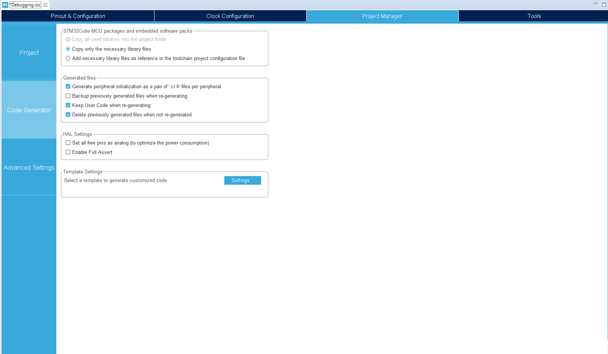
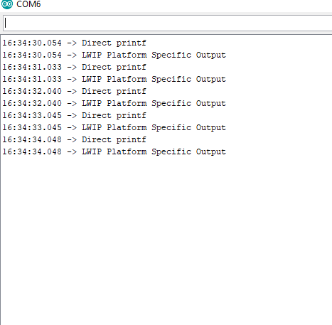
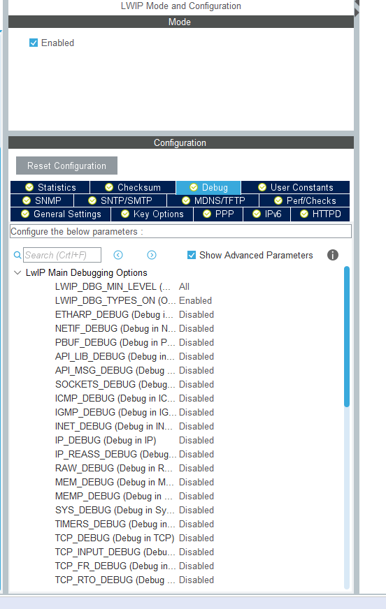
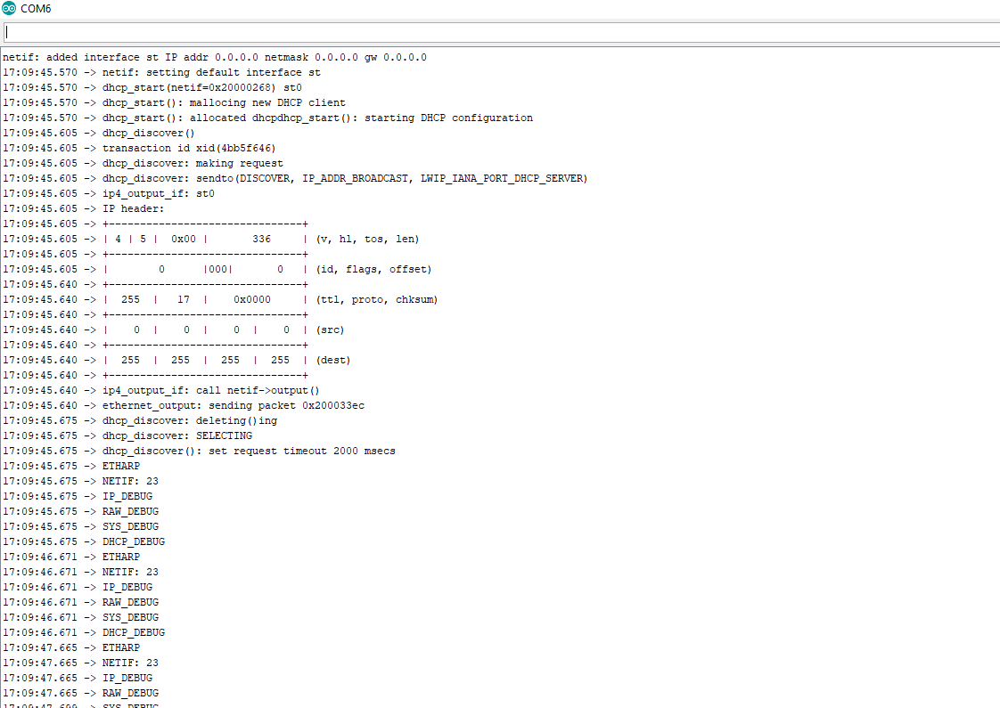

# LWIP Debugging Setup
-  **CubeIDE 1.3.0**
-  **uC:** STM32F429ZITx
-  **Cube Firmware** FW_F4 V1.25.0
-  **LWIP:** 2.1.2
----------------------------------

This project is a basic working STM32CubeIDE template with LWIP debugging setup to a UART.
This is particularly useful when setting up and diagnosing issues with the stack.

1. In the CubeIDE, setup a standard board with ETH enabled and UART3 enabled (or UART of choice).
2. I prefer seperating the different peripheral headers by default for the code generation so I enable that in the project manager before generating code  

3. In the Middleware section, enable LWIP
4. Generate the project code
5. Enable printf redirect to UART, I added it to my *LWIP/App/lwip.c* file but it can be moved around as makes sense in your project directory structure. Don't forget to include the "usart.h" in the code if it is not already there.
If this worked, standard printf commands should show up on an open serial port. Note I am using UART3 in this case, if a different UART was picked, change huart3 to huartx where x is your UART number.

~~~
/*Called by Core -> syscalls.c with weak linkage
adding this function somewhere in the project (with relevant includes)overwrites the syscalls.c __io__putchar definition
This redirects through the ST Link*/

int __io_putchar(int ch)
{
	  HAL_UART_Transmit(&huart3, (uint8_t *)&ch, 1, 0xFFFF);

	  return ch;
}
~~~
6.  
The LWIP debugging API consists of a large set of flags that can be enabled or disabled. If the correct flags have been set. <b>By default debugging information will be passed to the 'printf' function</b>.

LWIP makes provision for a platform specific debug option shown below from 'Middlewares/Third_Part/LwIP/src/include/lwip/arch.h'. If needed this macro can be defined in some other manner and the LWIP debugging information should still come through (like using SPI instead).

~~~
/** Platform specific diagnostic output.\n
 * Note the default implementation pulls in printf, which may
 * in turn pull in a lot of standard libary code. In resource-constrained 
 * systems, this should be defined to something less resource-consuming.
 */
#ifndef LWIP_PLATFORM_DIAG
#define LWIP_PLATFORM_DIAG(x) do {printf x;} while(0)
#include <stdio.h>
#include <stdlib.h>
#endif
~~~

7. A quick test now to make sure UART is setup correctly is a good idea to avoid unnecessary frustrations. I generally test by adding to the main loop below and validating it comes through over the serial interface. If all went well, the printf redirection should be visible as well as the LWIP specific macro statement. 
~~~
  /* Infinite loop */
  /* USER CODE BEGIN WHILE */
  while (1)
  {
      /*Don't forget the newline character for the printf,
      It will buffer until a newline character is found ! */
	  printf("Testing\n");
      LWIP_PLATFORM_DIAG(("LWIP Platform Specific Output\n"));
	  HAL_Delay(1000);
    /* USER CODE END WHILE */

    /* USER CODE BEGIN 3 */
  }
  /* USER CODE END 3 */
~~~

 

8. 
If printf redirection is working, then we can test LWIP specific debugging. Go into the STM32MX project, and under the LWIP settings, go to debug and select 'Show Advanced Parameters'.    This will present you with a large selection of debugging options that comes with the LWIP framework

 

9. Enable the following options via the STM32MX project settings in the 
- LWIP_DBG_TYPES_ON
- ETHARP_DEBUG 
- NETIF_DEBUG
- IP_DEBUG
- RAW_DEBUG
- SYS_DEBUG
- DHCP_DEBUG

9. Add the following code into the main loop source files and recompile
~~~
  /* Infinite loop */
  /* USER CODE BEGIN WHILE */
  while (1)
  {
	  //MX_LWIP_Process(); /*This line must be reincluded for the actual interface processing to work*/
	  LWIP_DEBUGF(ETHARP_DEBUG,("ETHARP\n"));
	  LWIP_DEBUGF(NETIF_DEBUG,("NETIF: %d\n",23));
	  LWIP_DEBUGF(IP_DEBUG,("IP_DEBUG\n"));
	  LWIP_DEBUGF(RAW_DEBUG,("RAW_DEBUG\n"));
	  LWIP_DEBUGF(SYS_DEBUG,("SYS_DEBUG\n"));
	  LWIP_DEBUGF(DHCP_DEBUG,("DHCP_DEBUG\n"));
	  HAL_Delay(1000);
    /* USER CODE END WHILE */

    /* USER CODE BEGIN 3 */
  }
  /* USER CODE END 3 */
~~~

10. If we open up a serial com, we should now be able to see a whole bunch of debugging information regarding these specific LWIP modules. Without the MX_LWIP_Process() function the actual ethernet comms are not going to work, but this is just meant to be highlighting how the debug options work.
In the main loop we are manually printing to serial using the debug flags we enabled. You can see on the NETIF flag, we are also passing an integer and having it formatted as expected.

So you can leverage the LWIP macros if you want and use their verbosity options such that only warnings are shown etc. but that is not really explored here. One note about the printf redirection, floating point numbers are not necessarily enabled by default and they may have to be explicitly added as a flag in the project.
 
 
